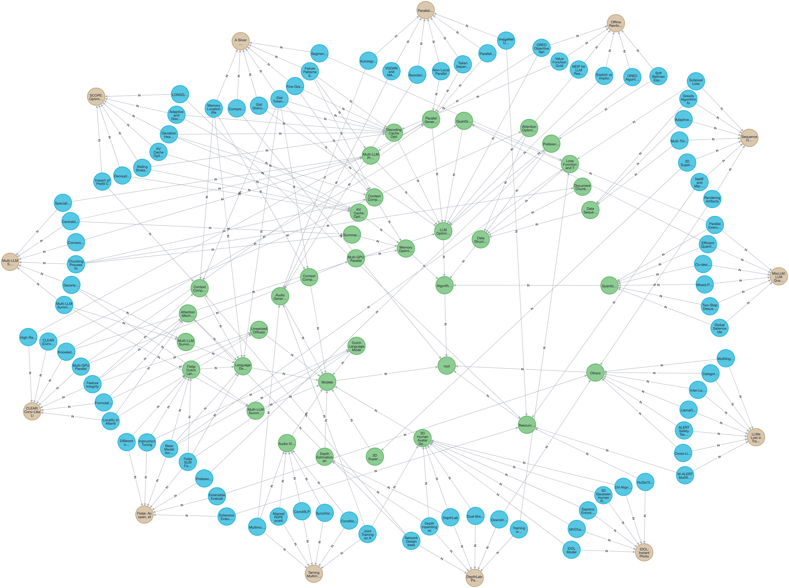

## Paper Assistant: Organize and Explore Research Papers.

### Purpose

The main goal here is to just have a better way of organizing papers for readers of [Daily Papers](https://huggingface.co/papers). It leverages Neo4j and Google AI Studio's Gemini 2.0 Flash to create a knowledge graph of papers, their concepts, and relationships, allowing you to easily discover connections and insights.  It's designed for readers of Daily Papers who want a deeper understanding of the research landscape.

### Setup

To get started, you'll need to do the following:
1.  **Install Neo4j Desktop:** Download and install [Neo4j Desktop](https://neo4j.com/download/). This is necessary to create and manage your local graph database.

2.  **Create a Neo4j Database:**
    *   Open Neo4j Desktop.
    *   Create a new DBMS.
    *   Inside the DBMS, create a new database (e.g., named `paper_assistant`).
    *   Start the database.

3.  **Set the `DATABASE` Environment Variable:**
    *   Create a `.env` file in the root of your project directory.
    *   Add the `DATABASE` variable to the `.env` file. The value should be the URI to connect to your Neo4j database. (e.g., `DATABASE=bolt://localhost:7687` - check the Neo4j Desktop connection details.)

4.  **Get a Google AI Studio API Key:**
    *   Go to [Google AI Studio](https://aistudio.google.com/) and create an account (if you don't already have one).
    *   Create a new API key.
    *   Add the `GEMINI_API_KEY` variable to your `.env` file: `GEMINI_API_KEY=YOUR_GEMINI_API_KEY`

5.  **Install Python Dependencies:**
    *   Run `pip install -r requirements.txt` to install the required Python packages, including [docling](https://github.com/DS4SD/docling), which is used for text processing and analysis.

6. **Note:**
    *   The pdf for the papers processed are stored in the `papers/` directory, and the corresponding markdowns are stored in the `markdown/` directory. A few of these have been added as a starting point.

### Usage

In order to get started, you should first populate the `DATABASE` and `GEMINI_API_KEY` in the `.env.

There are 2 user-facing scripts -
1. **`store.py`**:
    *   This script is used for processing today's papers and storing them in the graph db.
    *   To process the papers already provided in the `papers/` directory, you can run this script with `--existing`.
    *   The data should now be available in the database.
2. **`retrieve.py`**: This script allows you to interact with the db and explore the relationships between papers, concepts, and clusters.
    * **Example Queries:**
        * "What's <xyz> paper all about"
        * "List various approaches related to <xyz>"
    * **Exiting the Loop:**  Type `"exit"` / `"q"` / `"quit"` to end the loop.

### Images

Here's a visualization of the knowledge graph generated from the existing papers in the `papers/` directory:

*The graph shows papers (orange), concepts (blue), and clusters (green). This visualization helps understand the connections between research areas.*
